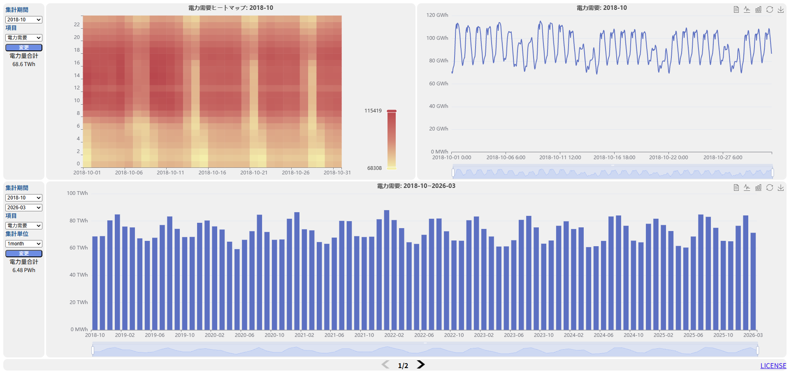
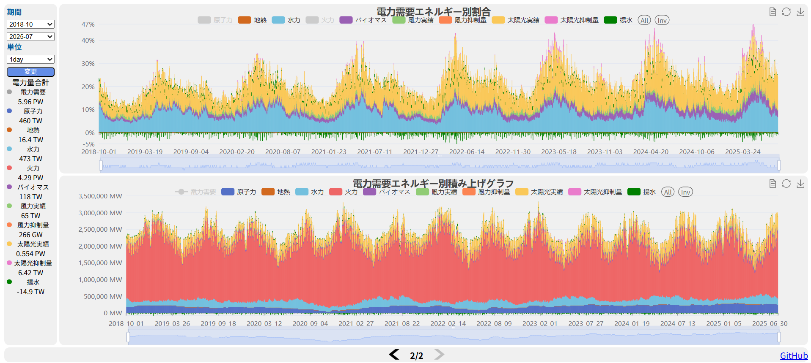

# 日本の電力需給チャート

<p align="right">
  <strong>日本語</strong> | <a href="./README_EN.md">English</a>
</p>

[](https://github.com/BEROCHLU/power-demand-chart/actions/workflows/deploy-s3.yml)
[](LICENSE)

日本の電力需給実績を、ヒートマップ、時系列グラフ、積み上げグラフ、構成比グラフで確認する静的 Web アプリケーションです。

このリポジトリは、月別 CSV を `dist/data/rowdata-all.json` に変換し、ブラウザ上で読み込んで ECharts に描画します。サーバーサイド API は使わず、集計と表示はクライアント側で完結します。





## 公開先

AWS S3 の静的 Web サイトホスティングで公開します。

[http://aws-s3-tokyo.s3-website-ap-northeast-1.amazonaws.com/](http://aws-s3-tokyo.s3-website-ap-northeast-1.amazonaws.com/)

`main` ブランチへの push をトリガーに、GitHub Actions が `npm install`、`npm run build`、`dist` の S3 同期を実行します。

## 主な機能

- 月単位で対象期間を選択できます。
- `電力需要`、`原子力`、`地熱`、`水力`、`火力`、`バイオマス`、`風力実績`、`風力抑制量`、`太陽光実績`、`太陽光抑制量`、`揚水` を表示できます。
- 1時間、1日、1か月、1年の粒度に集計して表示できます。
- ECharts の DataZoom で期間を拡大、移動できます。
- ECharts の toolbox からデータ表示、グラフ形式切り替え、画像保存ができます。
- `mathjs` の単位フォーマットで、合計値や軸ラベルを `MWh`、`GWh`、`TWh` など読みやすい単位に整形します。

## 画面構成

画面下部の左右ボタンで 2 つのパネルを切り替えます。

### 1ページ目: 個別項目の推移

1ページ目は、単一項目の月内または期間内推移を見る画面です。

- 上段左の条件で、対象月と項目を選択します。
- 上段中央に、日付 x 時刻のヒートマップを表示します。
- 上段右に、同じ月の時系列グラフを表示します。
- 下段左の条件で、開始月、終了月、項目、集計単位（1時間、1日、1か月、1年）を選択します。
- 下段右に、選択期間の時系列グラフを表示します。

### 2ページ目: エネルギー別の内訳

2ページ目は、電力需要と各電源項目の関係を見る画面です。

- 左の条件で、開始月、終了月、集計単位（1時間、1日、1か月、1年）を選択します。
- 上段に、電力需要エネルギー別割合を表示します。
- 下段に、電力需要エネルギー別積み上げグラフを表示します。
- 凡例をクリックすると、項目ごとの表示と非表示を切り替えられます。
- 左側には、表示中データの項目別合計値を表示します。

## データ

現行の `dist/data/rowdata-all.json` には、次のデータが含まれています。

| 項目 | 内容 |
| --- | --- |
| 収録レコード数 | 65,063 |
| 日付範囲 | 2018-10-01 から 2026-03-31 |
| 粒度 | 1時間 |
| 単位 | MWh |
| 入力ファイル | `rawdata/data/*_10エリア計.csv` |
| 生成ファイル | `dist/data/rowdata-all.json` |

CSV のヘッダーには「一般送配電事業者各社の公表データを元に作成」と記載されています。元 CSV は CP932/Shift_JIS で、変換スクリプトは `xlsx` に `codepage: 932` を指定して読み込みます。

注意点:

- `rawdata/data` の現行ファイル範囲は `201810_10エリア計.csv` から `202603_10エリア計.csv` です。
- `2026-02` の CSV は現行リポジトリに含まれていません。
- 現行 JSON では `2024-03` が 743 レコードで、1時間分少ない状態です。
- 四捨五入などにより、CSV 上の合計と個別項目の和が一致しない場合があります。

## 技術構成

| 用途 | 使用技術 |
| --- | --- |
| グラフ描画 | ECharts |
| クライアント側集計 | crossfilter2 |
| 日付処理 | dayjs |
| 単位表示 | mathjs |
| DOM 操作、タブ切り替え | jQuery |
| 配列、オブジェクト処理 | lodash |
| バンドル | webpack |
| データ変換 | TypeScript + xlsx |
| デプロイ | GitHub Actions + AWS S3 |

## ディレクトリ構成

```text
.
├── .github/
│   ├── image1.png
│   ├── image2.png
│   └── workflows/deploy-s3.yml
├── dev/
│   ├── css/style.css
│   └── src/
│       ├── jqtab.js
│       ├── native.js
│       └── vendor.js
├── dist/
│   ├── build/
│   │   ├── main.js
│   │   ├── vendor.js
│   │   └── vendor.js.LICENSE.txt
│   ├── css/style.css
│   ├── data/rowdata-all.json
│   ├── img/
│   └── index.html
├── rawdata/
│   ├── create-rowdata.ts
│   └── data/
├── package.json
├── tsconfig.json
└── webpack.config.js
```

主要ファイル:

- `dist/index.html`: 実行時に配信される HTML です。
- `dist/css/style.css`: 実行時に配信される CSS です。
- `dev/src/native.js`: データ読み込み、集計、ECharts の描画処理です。
- `dev/src/jqtab.js`: 2ページ構成のパネル切り替え処理です。
- `rawdata/create-rowdata.ts`: `rawdata/data` の月別 CSV を `dist/data/rowdata-all.json` に変換します。
- `webpack.config.js`: `dev/src/native.js` と `dev/src/jqtab.js` を `dist/build/main.js`、`dist/build/vendor.js` にバンドルします。

## セットアップ

Node.js 22 系を前提にしています。GitHub Actions でも Node.js 22 を使用しています。

```bash
npm install
```

## ビルド

本番用バンドルを作成します。

```bash
npm run build
```

開発用 sourcemap 付きでビルドする場合:

```bash
npm run build-v
```

ファイル変更を監視してビルドする場合:

```bash
npm run build-w
```

webpack が生成するのは JS バンドルです。`dist/index.html`、`dist/css/style.css`、`dist/data/rowdata-all.json`、`dist/img` は webpack の出力対象ではなく、静的ファイルとしてそのまま配信されます。

## ローカル確認

このアプリは `fetch('./data/rowdata-all.json')` で JSON を読み込みます。ブラウザで `dist/index.html` を直接開くと、環境によっては `file://` の制限でデータ読み込みに失敗します。ローカル HTTP サーバーで `dist` を配信してください。

例:

```bash
python3 -m http.server 8000 --directory dist
```

ブラウザで次を開きます。

```text
http://localhost:8000/
```

## データ更新

月別 CSV を更新したら、JSON を再生成します。

1. `rawdata/data` に `YYYYMM_10エリア計.csv` 形式の CSV を配置します。
2. 次のコマンドを実行します。

```bash
npm run create-data
```

このコマンドは `rawdata/create-rowdata.ts` を実行し、`dist/data/rowdata-all.json` を上書きします。

変換処理の概要:

- `rawdata/data` 配下のファイルを読み込みます。
- 先頭 3 行をスキップし、4 行目をヘッダーとして扱います。
- `需要` を `電力需要` にリネームします。
- `月日` を `YYYY-MM-DD` に変換します。
- `時刻` を数値の時刻に変換します。
- `需要` が数値ではない行はログ出力してスキップします。

補足: `create-data` は `npx ts-node` を使います。環境に `ts-node` が無い場合、初回実行時に `npx` が取得を試みます。

## デプロイ

`.github/workflows/deploy-s3.yml` は、`main` ブランチへの push で次を実行します。

1. リポジトリを checkout します。
2. Node.js 22 をセットアップします。
3. `npm install` を実行します。
4. `npm run build` を実行します。
5. AWS 認証情報を GitHub Secrets から読み込みます。
6. 既存 S3 バケット内容を `backup` に同期します。
7. `dist` 配下を `s3://aws-s3-tokyo` に同期します。

必要な GitHub Secrets:

- `AWS_ACCESS_KEY_ID`
- `AWS_SECRET_ACCESS_KEY`

AWS リージョンは `ap-northeast-1` です。

## 開発メモ

- アプリ本体はプレーンな JavaScript で、React や Vue などの UI フレームワークは使っていません。
- `dist/data/rowdata-all.json` は約 16 MB あります。初回表示時はこの JSON の読み込み後にチャートを初期化します。
- `dev/src/vendor.js` は生成済みバンドルです。通常の開発では `dev/src/native.js` と `dev/src/jqtab.js` を編集します。
- `dist/css/style.css` が実際に HTML から参照されます。CSS を変更する場合は、配信対象の `dist/css/style.css` を更新してください。
- 現在の `package.json` にはテスト用スクリプトはありません。

## ライセンス

MIT License です。詳細は [LICENSE](LICENSE) を参照してください。
